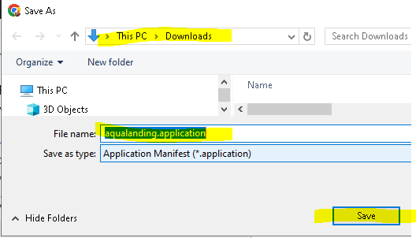
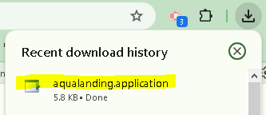
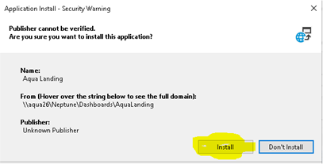
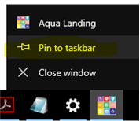

# Hopefully you enjoyed the VMS training!  
As discussed in the training, I suggest using the Aqua Landing app to launch Visitor Management System (VMS).
  
Below are the steps to install the Aqua Landing App I showed in training. 
 This app allows easily access the Visitor Management System (VMS) as well as other Aqua apps!
 
1. Click on [this link](aqualanding.application) to save & open (see below)
 
-Click "Save" to download file to <i>Downloads</i> folder. 
 
-Left click on downloaded file to open file to install 
 
2.	Click Install button  (see below)
 

 
3.	After Aqua Landing is installed, I suggest pin to your taskbar (see below)
 

  
If you have any questions let me know. 
  
Chuck Konkol 
Senior Programmer/Analyst II 
AQUA-AEROBIC SYSTEMS, INC. 
6306 N. Alpine Rd. 
Loves Park, IL 61111-7655 
Ph: 815-639-4574 
E-mail: ckonkol@aqua-aerobic.com  
www.aqua-aerobic.com 
Follow Us: LinkedIn and Twitter

 
